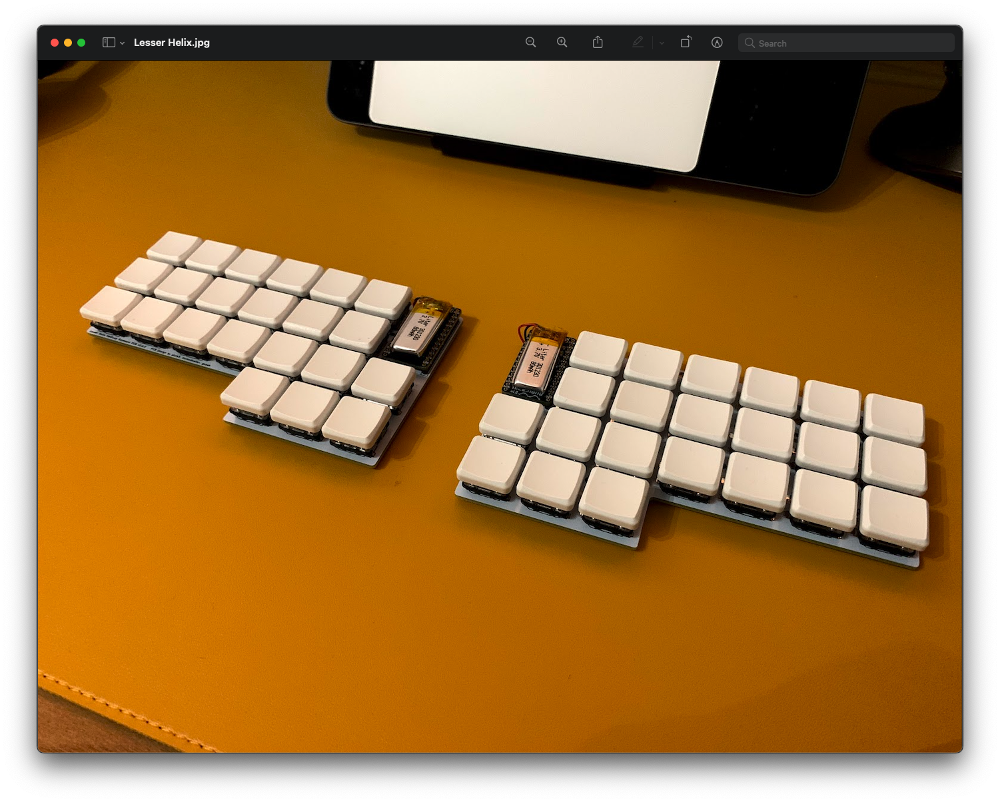
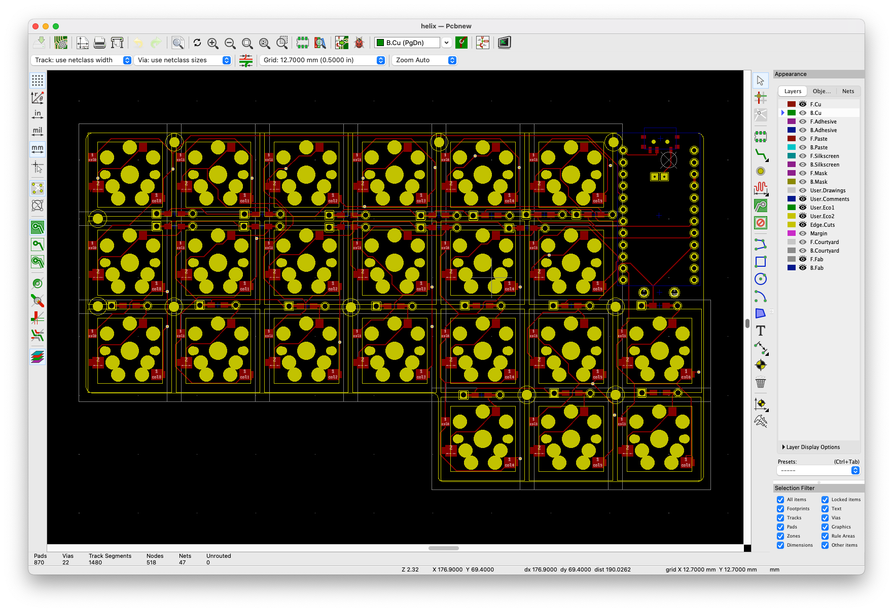

# Lesser Helix

A very compact, split, ortholinear, hot-swappable keyboard designed for use
with the nice!nano.

## Features

- Hotswap choc and mx sockets
- No TRRS jack
- Battery switch

## Credits

- [MakotoKurauchi](https://github.com/MakotoKurauchi/helix)
- [McMadhatter](https://github.com/mcmadhatter/helix)